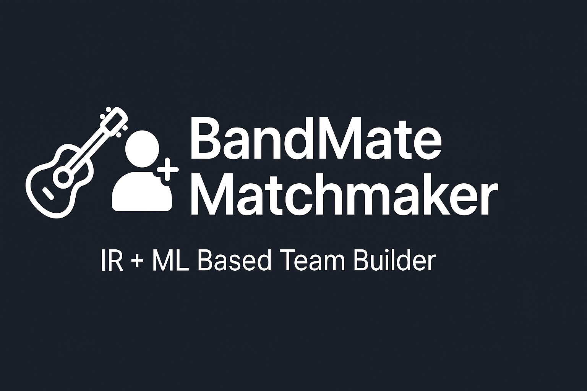

# 🎸 Dream Team MatchMaker – BandMate Recommender System



---

## 🔍 Overview

**Dream Team MatchMaker** is a smart hybrid recommender system that helps musicians find compatible bandmates based on genre, skills, personality, and musical background. It blends **Information Retrieval (IR)** and **Machine Learning (ML)** to make intelligent, ranked match suggestions.

---

## 🚀 Features

- 🎶 Personalized bandmate suggestions
- 🧠 Hybrid scoring using TF-IDF + LightGBM
- 📈 Evaluation with Accuracy, Precision, Recall, F1
- 🔝 Ranking metrics like NDCG@5, MAP, and Precision@K
- 💬 Compatibility feedback in natural language
- 🔄 Two interaction modes: Full Band or N Bandmates

---

## 🧠 Tech Stack

- **Python 3**
- **Pandas** – Data handling
- **Scikit-learn** – TF-IDF, metrics
- **LightGBM** – ML model
- **NLTK** – Text cleaning (stopwords, lemmatization)
- **Matplotlib** – Metric visualization

---

## 📁 Dataset Used

- `groundtruth.csv`: Labeled compatibility pairs (for ML training)
- `bandmates.csv`: Bandmate bios, skills, genres, personality

---

## 📊 System Flow

1. User enters preferences (genre, skills, background, etc.)
2. Clean & vectorize text using TF-IDF
3. Train LightGBM model to predict match compatibility
4. Score each candidate:  
   `final_score = 0.5 * similarity + 0.5 * ML prediction`
5. Recommend top-N candidates with feedback
6. Evaluate using ranking & classification metrics

---

## 🖼 Sample Output

```bash
Name: John Bonham
Genres: Rock, Hard Rock
Skills: Drums, Timing
Score: 0.82
Feedback: Match based on shared genre(s): rock and related musical background
